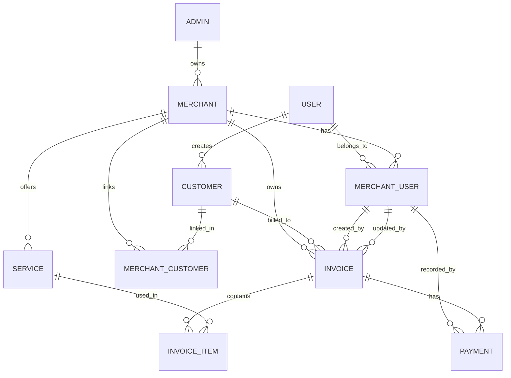

# InvoicePro

InvoicePro is a multi-tenant invoicing platform for businesses to manage customers, services, invoices, and payments in a single application.

The project is designed around a clear business model: each merchant owns its own data, users belong to a merchant context, and invoice/payment operations are validated against that tenant boundary.

## What it does

- Manage merchant/company information
- Manage merchant users
- Manage customers and merchant-customer relationships
- Manage services and pricing
- Create and update invoices with line items
- Record and track payments
- View invoice and payment data through a dashboard and API

## Core principles

This project focuses on:

- Multi-tenant data isolation
- Service-layer business rules
- Clean layered backend architecture
- Strong domain relationships between merchants, customers, invoices, and payments
- A realistic path from MVP to production security

## Tech stack

### Frontend
- React
- TypeScript
- Vite

### Backend
- .NET 10
- ASP.NET Core Web API
- Entity Framework Core
- PostgreSQL

### Architecture
- React client for the UI
- ASP.NET Core controllers for HTTP
- Service layer for business logic
- EF Core + PostgreSQL for persistence

## Current status

The project currently includes the core domain model and backend foundations, including:

- Merchant and user model
- Customer and service management
- Invoice and invoice item logic
- Payment tracking
- DTO-based API contracts
- Search, filter, sort, and pagination support
- Tenant integrity checks in business services

Authentication, authorization, and production security work are still in progress.

## Project structure

```text
invoice/
├── client/
│   └── src/
├── server/
│   ├── Controllers/
│   ├── Data/
│   ├── DTOs/
│   ├── Entities/
│   ├── Interfaces/
│   ├── Services/
│   ├── Migrations/
│   ├── Program.cs
│   └── appsettings*.json
├── README.md
├── invoice.slnx
└── package-lock.json
```

## ER diagram



### Important bug to address

A customer must belong to the same merchant as the invoice before the invoice is created or updated. Otherwise, a merchant could create invoices for customers from another merchant unless the service layer validates this relationship.

## Running locally

### Backend

```bash
cd server
dotnet run
```

### Frontend

```bash
cd client
npm install
npm run dev
```

## Notes

This is a portfolio and learning project with a strong emphasis on solid domain design and multi-tenant architecture. It is intentionally not presented as production-ready yet, because the project is still in the authentication and authorization phase.

The goal is to build the right foundation first: business rules, data boundaries, and maintainable architecture before adding the remaining security and deployment layers.

## License

License details will be added before public distribution.
# InvoicePro
